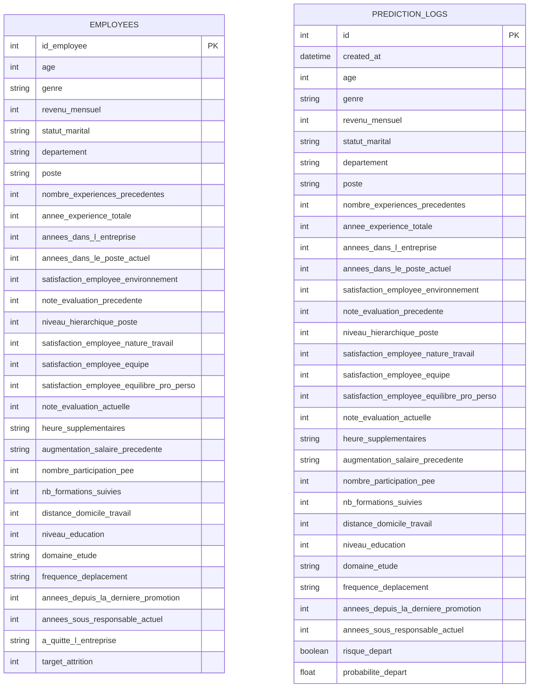

# Schéma de la base de données

Ce diagramme est écrit en [Mermaid](https://mermaid.js.org/) — GitHub le restitue automatiquement sous forme de diagramme visuel lors de l'affichage de ce fichier sur le dépôt.

## Notes de conception

**Pas de clé étrangère entre les deux tables.** `EMPLOYEES` est une donnée de référence (le dataset RH nettoyé du projet 4). `PREDICTION_LOGS` est un journal d'utilisation de l'API : une prédiction peut concerner un profil hypothétique qui n'existe pas dans `EMPLOYEES` (simulation, nouveau candidat). Les relier par clé étrangère contraindrait artificiellement un usage qui n'a pas vocation à être limité aux salariés déjà connus.

**Schéma volontairement dénormalisé** (pas de 3NF stricte, pas de tables de dimension séparées pour `departement`/`poste`). Justification détaillée dans le [README](../README.md#base-de-données) : volume très faible (1470 lignes, 3 départements, 9 postes), validation déjà assurée en amont par Pydantic, `PREDICTION_LOGS` suit le pattern standard d'un journal d'événements (souvent dénormalisé même dans des systèmes matures).

**Contraintes** : toutes les colonnes sont `NOT NULL` sauf `a_quitte_l_entreprise` et `target_attrition` dans `EMPLOYEES` (colonnes exclues des features du modèle mais conservées pour la traçabilité historique). `id_employee` (EMPLOYEES) et `id` (PREDICTION_LOGS) sont les clés primaires, `created_at` est généré automatiquement à l'insertion.